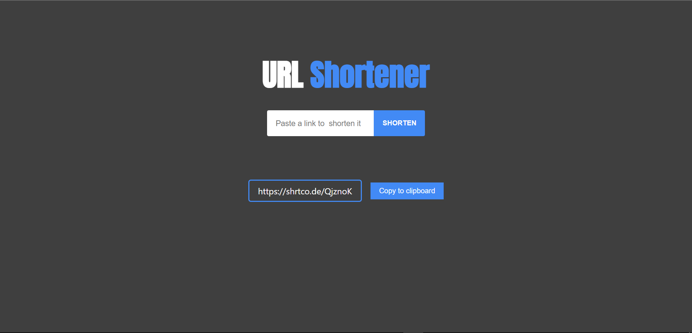

# url-shortener

This project was bootstrapped with [Create React App](https://github.com/facebook/create-react-app)

A URL shortener website built using React is a web application that allows users to create shorter, more manageable URLs for longer, complex ones.

Install the dependencies using npm:
### `npm install`

Start the development server:
### `npm start`

Runs the app in the development mode. 
Open [http://localhost:3000](http://localhost:3000) to view it in the browser.

Enter a long URL in the input field and click the "Shorten" button.

The shortened URL will be displayed below along with a copy button.

Click the copy button to copy the shortened URL to your clipboard.

## Technologies Used

React: JavaScript library for building user interfaces. 

npm: Package manager for installing project dependencies. 

Axios: Promise-based HTTP client for making API requests. 

react-copy-to-clipboard: React component for copying text to the clipboard.
